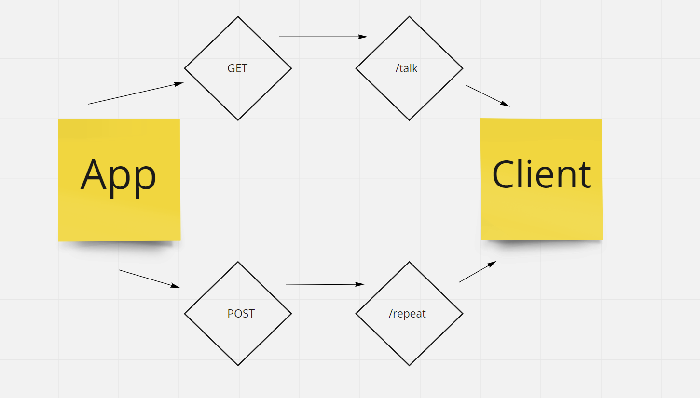

# Server Deployment Practice

Author: Katy Roffe

## Installation

* `npm install dotenv express jest`

## Problem Domain

* To create and deploy a practice web server using CI and CD.

## Deployment Links

[Dev Branch Deployment](https://katyroffe-server-deploy-dev.herokuapp.com/)
[Main Branch Deployment](https://katyroffe-server-deploy-prod.herokuapp.com/)

## UML

## Routes

* HTTP Get
  * Path: /repeat
  * this path should respond with the last string accepted by /talk
* HTTP Post
  * Path: /talk
  * this path should accept a string
  * this path should respond with a string
